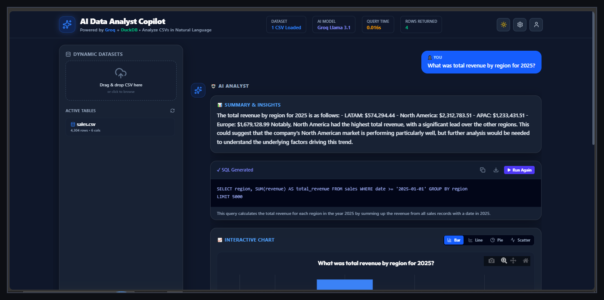
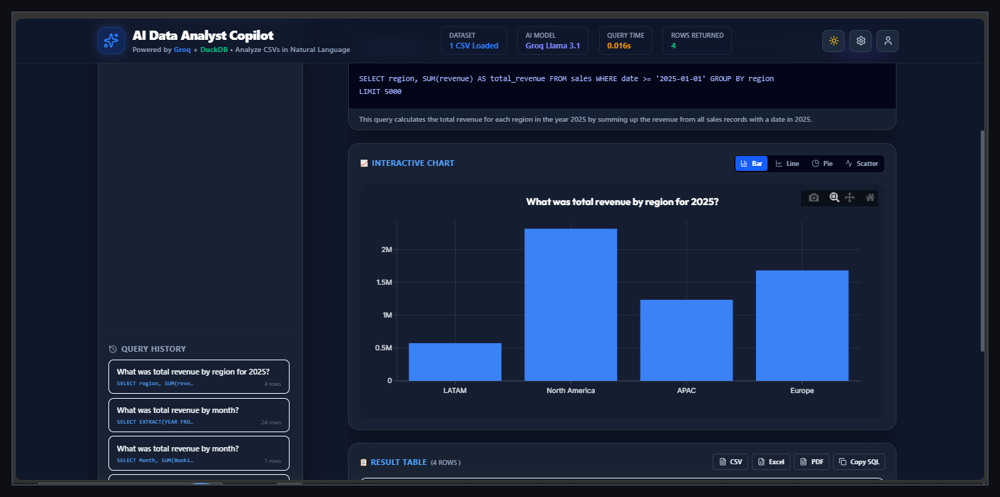
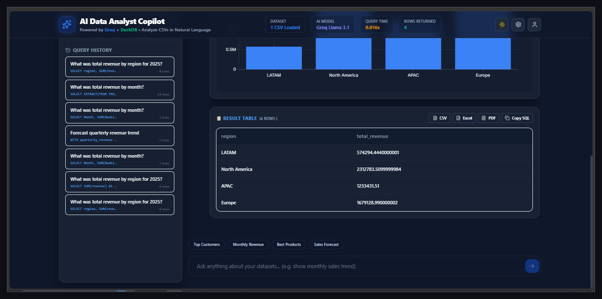

<div align="center">

# DataMind AI

### AI Data Analyst Copilot

Ask business questions in plain English → get generated SQL, a result table, an interactive chart, and a plain-English insight — powered by **Groq Llama 3.1** and **DuckDB**.


</div>

---

## Overview

**DataMind AI** is an end-to-end AI-powered data analysis platform. Upload a CSV, ask a question in natural language, and the app:

1. Converts your question into SQL using an LLM (Groq — Llama 3.1 8B Instant)
2. Validates and executes the SQL safely on DuckDB
3. Returns a results table, an auto-generated chart, and a business-insight summary

No SQL knowledge required — just ask.

## Screenshots

<table>
<tr>
<td width="50%">

**Ask a question, get SQL + insights**



</td>
<td width="50%">

**Interactive chart**



</td>
</tr>
<tr>
<td colspan="2">

**Query history & result table**



</td>
</tr>
</table>

## Features

- 📁 **Upload CSV Files** — drag & drop, automatic schema detection, dynamic table creation in DuckDB
- 🧠 **AI SQL Generation** — ask things like *"Show monthly sales"* or *"Top 10 customers"* and get an executable SQL query
- ⚙️ **Safe SQL Execution** — query validation, execution timeout, and error handling before anything touches your data
- 📊 **AI Insights** — plain-English summaries covering trends, anomalies, and recommendations
- 📈 **Interactive Dashboard** — generated SQL, results table, AI explanation, charts (bar / line / pie / scatter), and full query history
- 📤 **Export** — download results as CSV, Excel, or PDF, or copy the generated SQL

## Tech Stack

| Layer | Technology |
|---|---|
| Frontend | React.js, Vite, JavaScript, CSS, Fetch API |
| Backend | FastAPI, Python, DuckDB, Pandas |
| AI / LLM | Groq API, Llama 3.1 8B Instant, Prompt Engineering |
| Data | CSV Upload, DuckDB In-Memory Database, Dynamic Table Creation |

## Architecture

```
question
   │
   ▼
schema retrieval (keyword overlap over table/column names)
   │
   ▼
Groq (Llama 3.1) → generates SQL + explanation (JSON)
   │
   ▼
SQL guard: SELECT-only, no multi-statement, blocklist, LIMIT clamp
   │
   ▼
DuckDB executes query
   │
   ├──► anomaly.py: z-score outliers + period-over-period spike/dip detection
   ├──► charting.py: rule-based chart-type selection → chart figure
   └──► Groq → plain-English insight, grounded in computed stats + anomalies
   │
   ▼
JSON response → frontend renders SQL, table, chart, insight, anomalies
```

## Getting Started

### Prerequisites

- Python 3.11+
- Node.js 18+
- A [Groq API key](https://console.groq.com)

### Backend Setup

```bash
# clone the repo
git clone https://github.com/Garvitsingh66/DataMind-AI.git
cd DataMind-AI

# install dependencies
pip install -r requirements.txt

# configure environment
cp .env.example .env
# edit .env and add your GROQ_API_KEY

# run the API
uvicorn app.main:app --reload
```

### Frontend Setup

```bash
cd frontend
npm install
npm run dev
```

The app will be available at `http://localhost:5173`, with the API running at `http://localhost:8000`.

### Environment Variables

| Variable | Description |
|---|---|
| `GROQ_API_KEY` | Your Groq API key |
| `MODEL_NAME` | LLM model, e.g. `llama-3.1-8b-instant` |
| `DATA_DIR` | Directory for uploaded CSVs |
| `DUCKDB_PATH` | Path to persist DuckDB (empty = in-memory) |
| `MAX_ROWS` | Max rows returned per query |
| `QUERY_TIMEOUT_SECONDS` | SQL execution timeout |

## Usage

1. Start the backend and frontend (see above)
2. Drag and drop a CSV file into the dashboard
3. Ask a question in the chat box, e.g. *"What was total revenue by region for 2025?"*
4. View the generated SQL, results table, chart, and AI-written insight
5. Export results as CSV, Excel, or PDF as needed

## Roadmap

- [ ] Support for live Postgres / MySQL connections
- [ ] Multi-table joins in natural language
- [ ] Scheduled/recurring reports
- [ ] User authentication & saved dashboards

## Contributing

Contributions are welcome. Please open an issue to discuss what you'd like to change before submitting a pull request.

## License

This project is licensed under the MIT License.

---

<div align="center">
Built by <a href="https://github.com/Garvitsingh66">Garvitsingh66</a>
</div>
